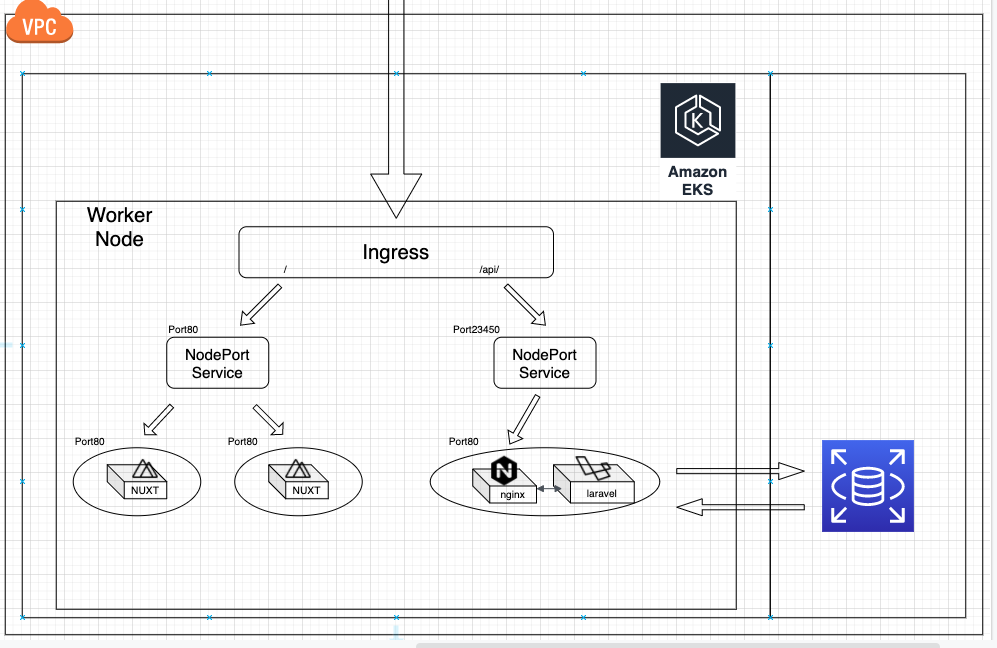

# 説明
AWSのEKSに英単語アプリをデプロイする。 
PROCEDURE.mdに従って作業するとできる。

  

# ディレクトリ構造
- docker 
英単語アプリのdocker imageを定義するためのフォルダ。 
フロントをnuxt、バックエンドをlaravelとclean architectureで実装している。

- eks 
dockerフォルダで定義した英単語アプリをeksにデプロイするためのフォルダ。 
yamlファイルがあり、k8sのためのkubectlコマンドを使って、yamlに書いてある定義でデプロイできる

- PROCEDURE.md 
eksにデプロイするためにどのような順番で作業すれば良いかを記述している  

# 参考資料
### docker・k8s
- [米シリコンバレーDevOpsエンジニア監修！超Docker完全入門(2020)【優しい図解説とハンズオンLab付き】](https://www.udemy.com/course/linux-docker-compose-dockerfile-kanzennyumon/)

- [米シリコンバレーDevOpsエンジニア監修！超Kubernetes完全入門(2020)【優しい図解説とハンズオン】](https://www.udemy.com/course/kubernetes-docker-container-devops-kanzen-nyumon/)

- [米シリコンバレーエンジニア監修！AWS EKS KubernetesハンズオンBest Practices (2020)](https://www.udemy.com/course/aws-eks-kubernetes-docker-devops-best-practices-2020/)

- [Docker/Kubernetes 実践コンテナ開発入門](https://www.amazon.co.jp/Docker-Kubernetes-%E5%AE%9F%E8%B7%B5%E3%82%B3%E3%83%B3%E3%83%86%E3%83%8A%E9%96%8B%E7%99%BA%E5%85%A5%E9%96%80-%E5%B1%B1%E7%94%B0-%E6%98%8E%E6%86%B2/dp/4297100339)  

### EKSでのnuxtとbackendの接続の参考
- [Golang + Nuxt.js + Kubernetes でWebサービスを作る](https://github.com/famasoon/gatsby-starter-blog/blob/4c696645707d0cdd33950820b647733088dd2d43/src/pages/Golang%20%2B%20Nuxt.js%20%2B%20Kubernetes%20%E3%81%A7web%E3%82%B5%E3%83%BC%E3%83%93%E3%82%B9%E3%82%92%E4%BD%9C%E3%82%8B/index.md)

- [Golang + Nuxt.js + Kubernetes でWebサービスを作る - その④](https://famasoon.hatenablog.com/entry/2019/08/08/010926)  

### laravelからRDSへの接続の参考
- [EC2とRDS（MySQL）でLaravel 構築 チュートリアル](https://noumenon-th.net/programming/2020/04/10/ec2-rds-laravel/)