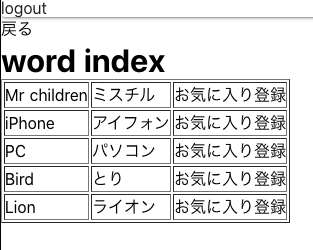
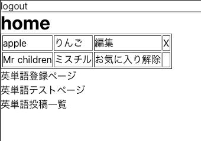
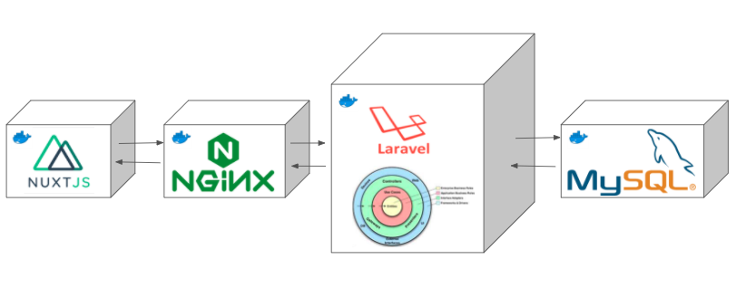

# 説明
英単語を登録できて、テストができるアプリ。 別のユーザーが登録した英単語をお気に入り登録できたりする。

  
 

# 構成
nuxtとlaravelとdbをdockerコンテナで作成した。 
EKSにデプロイする前提。 
dockerやnginxやphp-fpmも含めて自分で実装したので学んだことをコメントに追加している。  

  

# ディレクトリ構成
- container 
dockerfileの格納フォルダ 

- volume_conf 
コンテナにvolumeする設定ファイルをおくフォルダ 

- code 
コンテナにvolumeする実装コードをおくフォルダ  

- explain_img 
READMEで使う説明の図をおくフォルダ  

# EKSへのデプロイのためのdocker hubへのpush
docker hubにpushする際にはコードに修正を加えて作成したimageをpushする。
詳しくは以下を確認に記述 

- nuxt 
docker-compose(command,environment), dockerfile(CMD), nuxt.config.js(baseUrl) 

- laravel 
.env(DBの周りを変更、dbhostはrdsのエンドポイントに変更),   

# nginxやphp-fpmの構成の参考
- [nginx_phpfpm_demo](https://github.com/Tsuyoshi-Ishikawa/nginx_phpfpm_demo)

- [最強のLaravel開発環境をDockerを使って構築する【新編集版】](https://qiita.com/ucan-lab/items/5fc1281cd8076c8ac9f4)