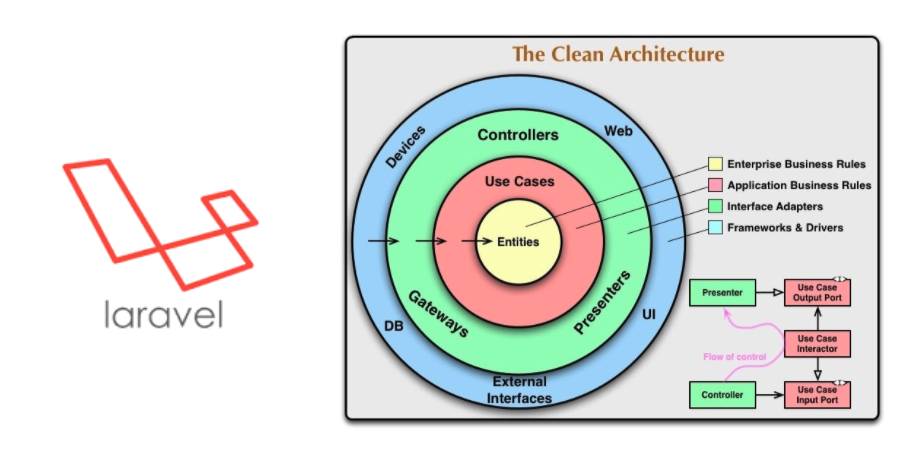
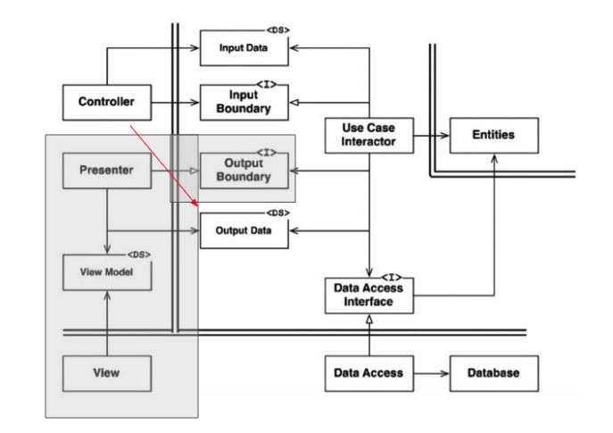

# 内容
英単語アプリのバックエンド。<br>
フレームワークにlaravelを使用して、clean architectureで実装している<br><br>

機能は
- ログイン
- 英単語登録、編集、削除
- 英単語テスト
- 別ユーザーの英単語お気に入り追加

<br><br>

# clean architectureの構造
PresenterとViewModelは採用をせず(一方通行にしない)、<br>OutputDataをUseCaseInteractorからControllerに返すようにしている。

<br><br>

### 各層の説明
- Controller<br>
DTOであるInputDataをnewで獲得して、UserCaseInteractorをDIで獲得している。<br>
Controllerの責務は入力内容を処理しやすい形に変換することなので、ここでは受け取ったデータをInputDataに格納して、UserCaseInteractorに渡す。<br>
入力内容を処理しやすい形に変換するという責務のため、Controllerではvalidation(入力の判定)は行わない。<br><br>

- UserCaseInteractor<br>
Entitiesをnewで獲得して、DataAccessをDIで獲得している。<br>
受け取ったInputDataと、EntitiesとDataAccessでうまく使えるように仲介を行う。<br>
通常のClean architectureの場合、PresenterとViewModelを使って一方通行で表示を行うが、<br>今回はUserCaseInteractorからOutputDataをControllerに返し、Controllerはそれを使ってフロントにjsonデータを返す。<br><br>

- Entities<br>
InputDataを格納したり、InputDataを使って新たな値を格納したり、validation(入力の判定)を行ったりする。<br><br>

- DataAccess<br>
Entitiesを使用して、Databaseに命令をする。<br>
Databaseへの命令方法はORMや生SQLがあるが、それに関してDataAccessで決めて命令をする。<br><br>

# ディレクトリ構成(./app配下)
- Http/Controller<br>
Controller層<br><br>
- Http/DataAccess<br>
DataAccess層<br><br>
- Http/DTO/Input<br>
ControllerからUserCaseInteractorに渡すDTO<br><br>
- Http/DTO/Output<br>
UserCaseInteractorからControllerに返すDTO<br><br>
- Http/Usecases/Entites<br>
Entites層<br><br>
- Http/Usecases/Interactor<br>
UserCaseInteractor層<br><br>
- User.php,Word.php<br>
DataAccess層で使用されるORM<br><br>


# その他こだわったところ
### ログイン
laravelではAuthという機能でログインを実装できるが、<br>こいつを使うとControllerでORMを使用することになりClean Architectureにならないと判断し採用せず。<br>
自分でUserControllerでログイン機能を実装。<br><br>

### バリデーション(入力判定)
validationはlaravelの機能にあるFormRequestを使用できるが、<br>それをするとController層の責務が「入力内容を処理しやすい形に変換」だけでなくなるので採用せず。<br>
簡単なバリデーションはEntities層で実装し、Databaseが関わるバリデーションはDataAccess層で実装する。<br>

バリデーションエラーが発生した場合はOutputDataにエラー内容を格納して、Controllerを通してフロントにバリデーションエラーがあったことを伝える。<br><br>

### DI
別の層のクラスインスタンスの獲得の仕方だが、<br>変更可能性が低いクラスは「new クラス名」で獲得して、<br>変更可能性が高いクラスはDependency Injectionで獲得している。<br>なぜなら変更可能性が高いクラスを使っている場合、<br>今のクラスから全く新しいクラスを使用する形なった時に変更容易性を確保したいから。<br>DIで導入すると、修正する際に修正コードが少なくて済むので良い。<br>

laravelの機能であるサービスプロバイダを使ってDIを行った。<br><br>

# 設定
### .env編集
```
DB_CONNECTION=mysql
DB_HOST=db
DB_PORT=3306
DB_DATABASE=laravel
DB_USERNAME=admin
DB_PASSWORD=password
```

AWSにデプロイするdocker_imagesを作成する場合はDB_HOSTをRDSのエンドポイントに設定。<br><br>

### cors policyに反する問題を解消
cors policyとは、オリジン (ドメイン、プロトコル、ポート番号) 間でのやりとりの約束。<br><br>

nuxtのオリジン(0.0.0.0)からlaravelのオリジン(0.0.0.0:23450)へ接続するとcors policyに反するため接続できなかった。
```
Access to XMLHttpRequest at 'http://0.0.0.0:23450/api/register' from origin 'http://0.0.0.0' has been blocked by CORS policy: No 'Access-Control-Allow-Origin' header is present on the requested resource.
```
これを解決するために、自前のCorsというmiddlewareを作成し受け入れ態勢を整えた。

- [CORSについて](https://qiita.com/Tsuyozo/items/6769f616b478726a5188)<br><br>

# 参考文献
### clean architecture
- [実装クリーンアーキテクチャ](https://qiita.com/nrslib/items/a5f902c4defc83bd46b8)

- [【プログラミング】実践クリーンアーキテクチャ 音ズレ修正Ver.](https://www.youtube.com/watch?v=BvzjpAe3d4g)

- [Clean Architecture 達人に学ぶソフトウェアの構造と設計](https://www.amazon.co.jp/Clean-Architecture-%E9%81%94%E4%BA%BA%E3%81%AB%E5%AD%A6%E3%81%B6%E3%82%BD%E3%83%95%E3%83%88%E3%82%A6%E3%82%A7%E3%82%A2%E3%81%AE%E6%A7%8B%E9%80%A0%E3%81%A8%E8%A8%AD%E8%A8%88-Robert-C-Martin/dp/4048930656)

### laravelのDependency Injection
- [Laravelのサービスプロバイダーの仕組みやメリットとは](https://www.geekfeed.co.jp/geekblog/laravel-service-providers)
